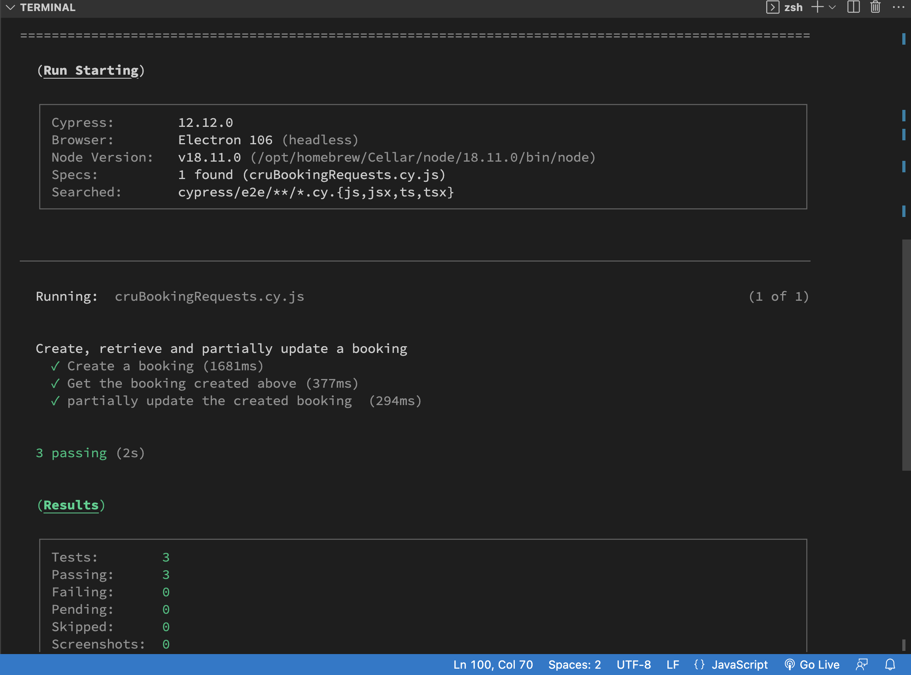

# Restful API Requests

## Project Description

This repo contains some automation scripts for the restful booker API available at https://restful-booker.herokuapp.com/apidoc/index.html for the below API requests/sceanrios:

1. Create a booking
2. Get the booking created above
3. Update the booking (change checkout date and additional needs)

We wrote the scripts with Cypress, which can be an alternative to Postman for small project like this one. 

## Requirements 

1. Node.js 14 or above
2. <a href="https://nodejs.org/en" target="_blank">Link to install Node.js</a>
3. To check the node version 'node -v' & npm version 'npm -v' 
4. Make sure you meet the <a href="https://docs.cypress.io/guides/getting-started/installing-cypress#System-requirements" target="_blank">System Requirements</a> listed by Cypress 

## Setup 

1. Clone the project 
2. Navigate to the project directory path
3. Install depedencies with the following command: npm install

## Run the script / the tests
To run the script in command line, type the following command: npx cypress run

**Overview of the outputs**

## Explanation video 

Here is the  <a href="https://drive.google.com/file/d/16mfcOJXE6A2dEmYsD4_f2vaqwnCTNHqw/view?usp=sharing" target="_blank">explanation video for the written code</a> .